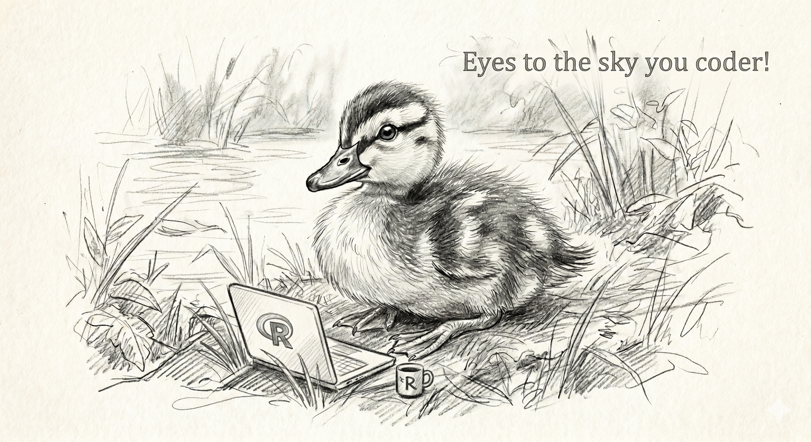

# On the Use of the Gather_Sera.R Function


## Welcome VirusPlusLab Member

Hello there! This is the ReadMe file for the custom function that
Jonathan Dain built for wrangling all of the Serum Data into a single
cohesive data frame.

## Getting the function into R

This is very simple. Download the `Gather_Sera.R` script into a local
directory of your choosing and then run the below command which will
load the function into your R environment.

``` r
source(file = "Gathering_Serum/Gather_Sera.R")
```

## Using the function:

The function has three main aruguments that can be passed to it. First
is the `path=` argument which accepts a character vector in which you
put the path to the files you want to read into R. For our lab this will
look something like OneDrive/Screening/Serology/Results (Note I obscured
our file structure for privacy reasons). The second argument is the
`add_individual_plate_info =` which accepts a logical (T/F) and is
useful for if you need to have the individual plate meta data attached
to your samples. By this I mean that when this is TRUE it will attach
the plate Map ID and ELISA type to each row. Finally is the
`ELISA_type =` argument which accepts a character such as NP for
nucleoprotien or H5 for Hemagglutinin ELISA. This is useful for keeping
our two ELISA’s seperate.

``` r
# Pulling in the NP data:
my_NP_data <- gather_sera(path = "Path to NP plates",add_individual_plate_info = T,ELISA_type = "NP")

# Pulling in the H5 data:
my_H5_data <- gather_sera(path = "Path to H5 plates",add_individual_plate_info = T,ELISA_type = "H5")
```

> ⚠️⚠️⚠️Warning: This function explicitly does not merge duplicate
> values from the initial ELISA plates. This means that care should be
> taken when determining the correct value to report for these initial
> runs.

That is basically all there is too it. If you want to understand a
little more about the function the top of the `Gather_Sera.R` script is
written in Roxygen2 syntax which details the formal definitions of each
parameter in more detail.

## In the future:

I will eventually wrap these into a formal R package called VPLToolsR
but that is down the line. For now enjoy and keep your eyes to the sky!


